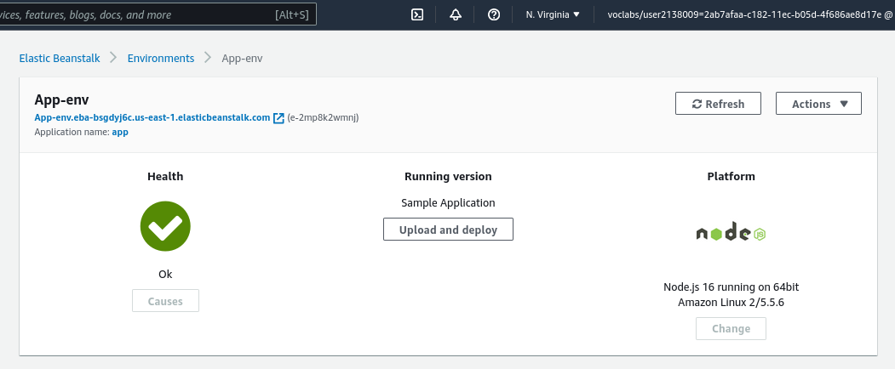
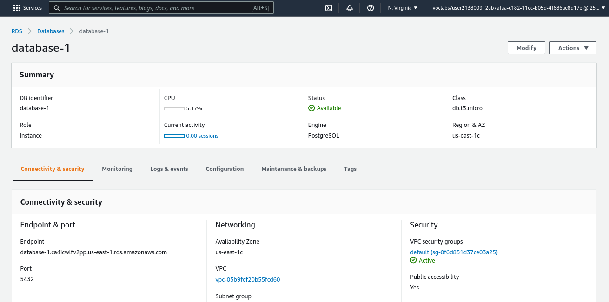

<h1 align="center">
  AWS Deployment Process
</h1>

  Udacity NANODEGREE Program - ( Third Project )
 
  Deploying a Full Stack Application to AWS Using EB, S3, RDS and CircleCI
 
  - By : Yousef Saeed - 

---

## Architecture

* [Read More][documentation/]

### Frontend

`Endpoint: http://random-yousef-bucket.s3-website-us-east-1.amazonaws.com/`

* [Read More][documentation/]

### Backend

`Endpoint: http://app-env.eba-bsgdyj6c.us-east-1.elasticbeanstalk.com/`

* [Read More][documentation/]

### Database

`Endpoint: database-1.ca4icwlfv2pp.us-east-1.rds.amazonaws.com`

* [Read More][documentation/]

## Built With

* [![AWS][aws.shield]][aws-url]
* [![CircleCI][circleci.shield]][circleci-url]

(<a href="#readme-top">Back to Top</a>)

[aws.shield]: https://img.shields.io/badge/Amazon_AWS-232F3E?style=for-the-badge&logo=amazon-aws&logoColor=white
[aws-url]: https://aws.amazon.com/

[circleci.shield]: https://img.shields.io/badge/circleci-343434?style=for-the-badge&logo=circleci&logoColor=white
[circleci-url]: https://circleci.com/

