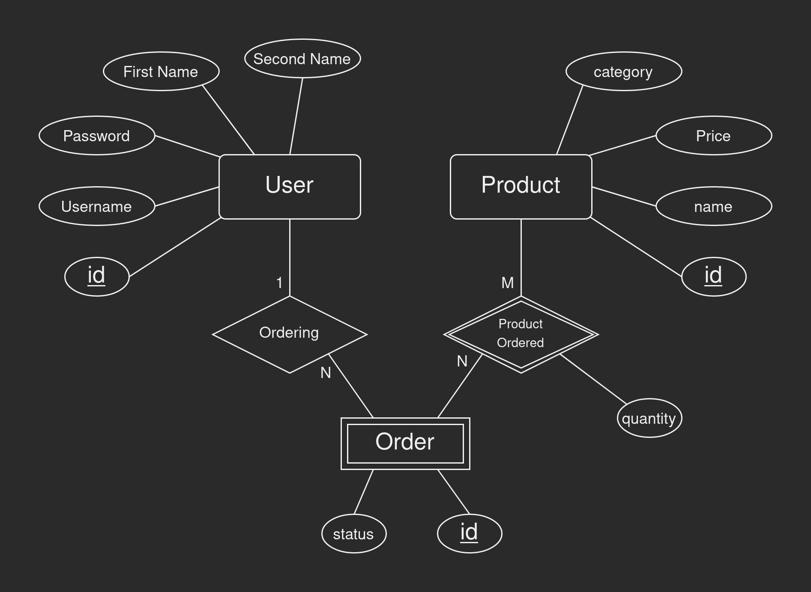
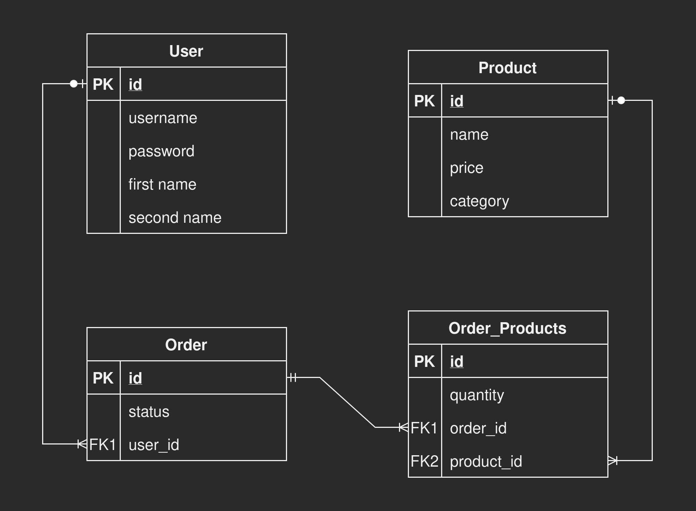

<a name="readme-top"></a>

<h1 align="center">
  Storefront-Backend
</h1>

<p align="center">
  Udacity NANODEGREE Program - ( Second Project )
<br>
  - By : Yousef Saeed - 
</p>

---

## Installation

### Build

```
npm run build
```

Build the TypeScript files into JavaScript files and save the JS files in the `./dist` directory.

### Start the server

```
npm run start
```

Start running the server on port `3000` and the DB on port `5432` (by default).

<br>

### Other Scripts

```
db-migrate up
```

Run **migration**

```
npm run up
```

Migrate *dev* and *test* database

```
npm run down
```

Migrate down *dev* and *test* database

```
npm run watch
```

Run **tsc-watch**

```
npm run test
```
Run **Jasmine**

```
npm run lint
```

Run **ESLint**


## Setup Database Using PSQL

Create dev database:

`CREATE DATABASE store_dev;`

Create test database:

`CREATE DATABASE store_test;`

Create a user:

`CREATE USER this_user WITH PASSWORD 'password123';`

Grant access on dev database:

`GRANT ALL PRIVILEGES ON DATABASE store_dev TO this_user;`

Grant access on test database:

`GRANT ALL PRIVILEGES ON DATABASE store_test TO this_user;`


## .env file example

```
POSTGRES_HOST=127.0.0.1
POSTGRES_DEV_DB=store_dev
POSTGRES_TEST_DB=store_test
POSTGRES_USER=this_user
POSTGRES_PASSWORD=password123
ENV=dev
BCRYPT_PASSWORD=secret-password
SLAT_ROUNDS=10
TOKEN_SECRET=secrettoken
```


## Database ER-Diagram and Schema





## Built With

* [![Node][node.shield]][node-url]
* [![TypeScript][ts.shield]][ts-url]
* [![PostgreSQL][pgsql.shield]][pgsql-url]
* [![Jasmine][jasmine.shield]][jasmine-url]
* [![Express][express.shield]][express-url]
* [![JWT][jwt.shield]][jwt-url]
* [![DB-Migrate][dbmig.shield]][dbmig-url]
* [![dotenv][dotenv.shield]][dotenv-url]


## Resources

- Select most repeated value in a column : https://stackoverflow.com/a/12235631/


<p align="right">(<a href="#readme-top">Back to Top</a>)</p>


[node.shield]: https://img.shields.io/badge/Node-43853D?style=for-the-badge&logo=node.js&logoColor=white
[node-url]: https://nodejs.org/

[ts.shield]: https://img.shields.io/badge/TypeScript-007ACC?style=for-the-badge&logo=typescript&logoColor=white
[ts-url]: https://www.typescriptlang.org/

[jasmine.shield]: https://img.shields.io/badge/Jasmine-8a4182?style=for-the-badge&logo=jasmine&logoColor=white
[jasmine-url]: https://jasmine.github.io/

[express.shield]: https://img.shields.io/badge/Express-404D59?style=for-the-badge&logo=express&logoColor=white
[express-url]: https://expressjs.com/

[pgsql.shield]: https://img.shields.io/badge/PostgreSQL-316192?style=for-the-badge&logo=postgresql&logoColor=white
[pgsql-url]: https://www.postgresql.org/

[jwt.shield]: https://img.shields.io/badge/json%20web%20tokens-323330?style=for-the-badge&logo=json-web-tokens&logoColor=pink
[jwt-url]: https://jwt.io/

[dbmig.shield]: https://img.shields.io/badge/db--migrate-d4d0cb?style=for-the-badge
[dbmig-url]: https://db-migrate.readthedocs.io/

[dotenv.shield]: https://img.shields.io/badge/.dotenv-ecd53f?style=for-the-badge
[dotenv-url]: https://www.dotenv.org/

