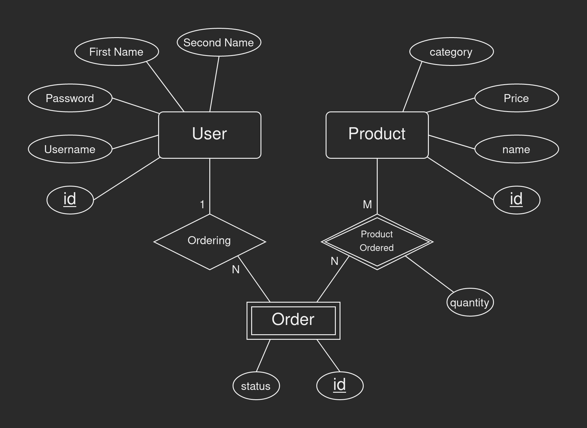
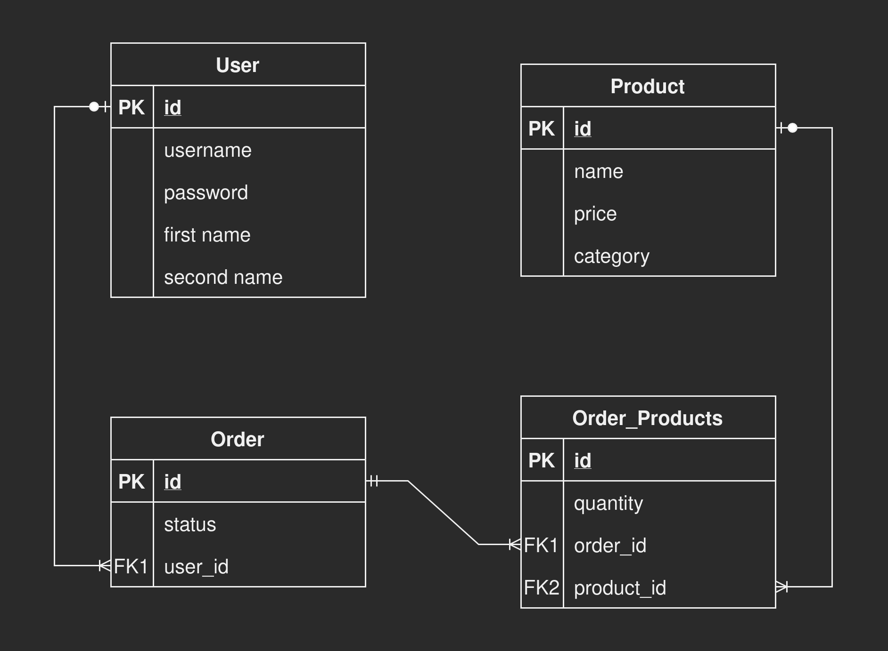

## ENDPOINTS

### Users Route

`http://localhost:3000/users`

* `/users` [GET] Index -Token Required-
* `/users/:id` [GET] Show -Token Required-
* `/users` [POST] Create
* `/users/auth` [POST] Authorize
* `/users` [DELETE] Delete -Token Required-

### Products Route

`http://localhost:3000/products`

* `/products` [GET] Index
* `/products/:id` [GET] Show
* `/products` [POST] Create -Token Required-
* `/products` [DELETE] Delete -Token Required-

### Orders Route

`http://localhost:3000/orders`

* `/orders/:id` [GET] Show -Token Required-
* `/orders` [POST] Create -Token Required-
* `/orders` [DELETE] Delete -Token Required-
* `/orders/done` [UPDATE] Update -Token Required-

### Dashboard Route

* `/top-products` [GET] Most Sold Products
* `/top-products/:n` [GET] Top <'number'> Most Sold Products
* `/filter-by-category` [GET] Filter Products By Category

## Data Shapes

### User

* **id** SERIAL PRIMARY KEY
* **username** VARCHAR(25)
* **password** VARCHAR
* **firstname** VARCHAR(30)
* **secondname** VARCHAR(30)

### Product

* **id** SERIAL PRIMARY KEY
* **name** VARCHAR(100)
* **price** DECIMAL
* **category** VARCHAR(30)

### Order

* **id** SERIAL PRIMARY KEY
* **status** BOOLEAN
* **user_id** BIGINT REFERENCES users(id)

### Order_Product

* **id** SERIAL PRIMARY KEY
* **quantity** SMALLINT
* **order_id** BIGINT REFERENCES orders(id)
* **product_id** BIGINT REFERENCES products(id)

