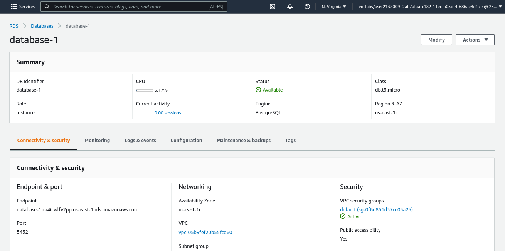
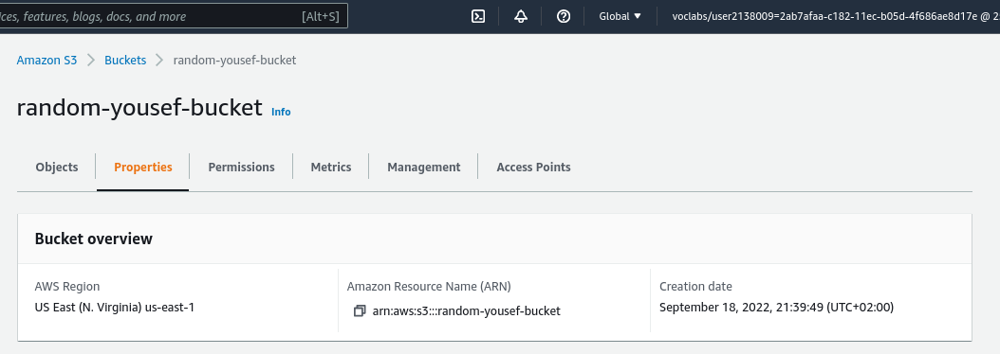
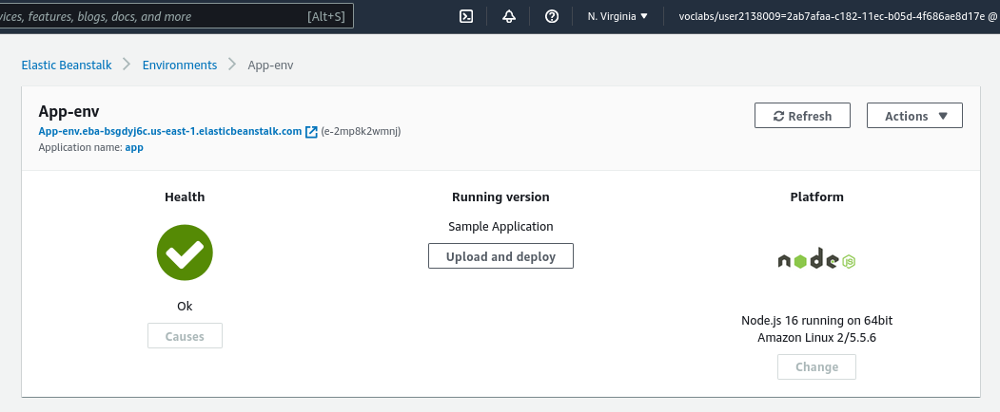
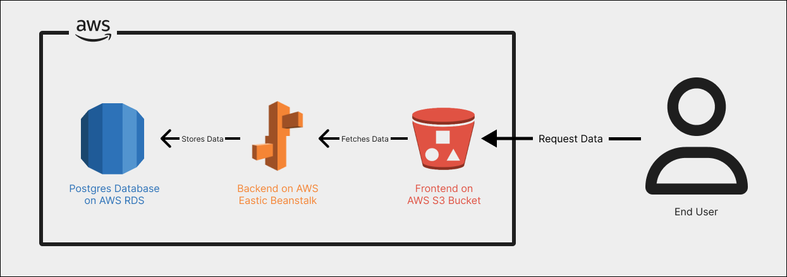

# Application Infrastructure

This documentation explains the infrastructure behind the application.

## General Application Components

The application is made up of the following components:

### Front-End

A simple application. This is the only component that the user interacts with directly.

### Back-End

Behind the front-end application sits as a Node.js API. The front-end application makes calls to this API to send and retrieve data.

### PostgreSQL Database

The database stores user and feed item information. The back-end API interacts with this database to store and retrieve information.

## Amazon Web Services (AWS) Infrastructure

The application is hosted using AWS resources.

### AWS Relational Database Service (RDS)

The PostreSQL database is provisioned using AWS RDS. It is a publicly accessible database hosted in the us-east-1 region on port: 5432.

`Endpoint: database-1.ca4icwlfv2pp.us-east-1.rds.amazonaws.com`

### AWS Simple Storage Service (S3)

The front-end is hosted as a static website using AWS S3. The application files are hosted in a publicly accessible storage bucket.

`Endpoint: http://random-yousef-bucket.s3-website-us-east-1.amazonaws.com/`

### AWS Elastic Beanstalk (EB)

The back-end is hosted using AWS EB. It is a t2.medium sized single instance environment.

`Endpoint: http://app-env.eba-bsgdyj6c.us-east-1.elasticbeanstalk.com/`

## Application Architecture Diagram

Below is an architecture diagram containing all of the application's components.

